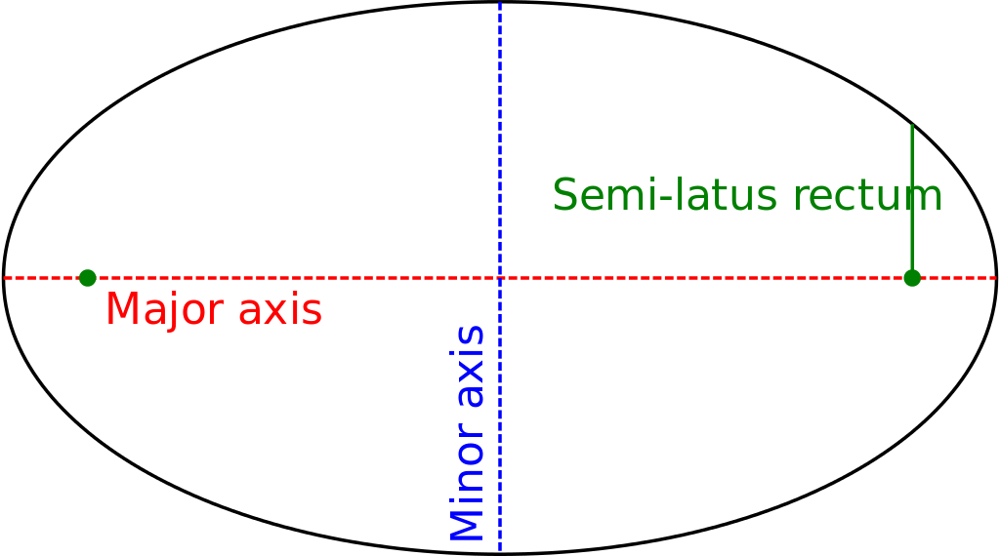

# lunar-phase
天狗吃月亮. 月有阴晴圆缺. 月食. 月相.

## Effect Graph


## How to use?

In xml file, 

```
    <me.bytebeats.views.lunarphase.LunarPhaseView
        android:id="@+id/lunar_phase_view"
        android:layout_width="match_parent"
        android:layout_height="250dp"
        app:durationInMillis="30000"
        app:intervalInMillis="100"
        app:layout_constraintBottom_toBottomOf="parent"
        app:layout_constraintLeft_toLeftOf="parent"
        app:layout_constraintRight_toRightOf="parent"
        app:layout_constraintTop_toTopOf="parent"
        app:phase="300"
        app:rotate="0" />

```

In Java/Kotlin file, 

```
    override fun onCreate(savedInstanceState: Bundle?) {
        super.onCreate(savedInstanceState)
        setContentView(R.layout.activity_main)
        btn.setOnClickListener { lunarPhaseView.start() }
    }

    override fun onConfigurationChanged(newConfig: Configuration) {
        super.onConfigurationChanged(newConfig)
        lunarPhaseView.rotate = if (newConfig.orientation == Configuration.ORIENTATION_LANDSCAPE) {
            90
        } else {
            0
        }
    }

    override fun onResume() {
        super.onResume()
        lunarPhaseView.resume()
    }

    override fun onPause() {
        super.onPause()
        lunarPhaseView.pause()
    }
```

## Implementation

Night sky is dark. So background is drawn with color of black.
Moon is round. So draw a circle to present Moon.
Then the Moon ellipse is implemented with an oval.



Fix Major axis, then change Minor axis, then you'll see the oval collapsed or expended.
